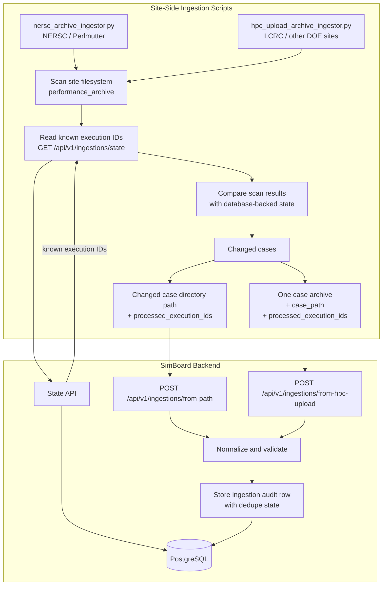

# Metadata Ingestion Architecture

HPC sites produce `performance_archive` metadata that SimBoard ingests into PostgreSQL. Automated ingestion uses one of two workflows depending on whether the source archive is readable from the SimBoard backend environment on NERSC Spin.

Browser/manual uploads are supported separately and are not part of automated HPC dedupe reconstruction.

## Ingestion Modes

Automated HPC ingestion uses two site-side scripts. Both use database-backed dedupe state, but they submit changed cases through different routes:

- `nersc_archive_ingestor.py` for local path ingestion on NERSC / Perlmutter
- `hpc_upload_archive_ingestor.py` for remote automated uploads from LCRC and other DOE sites

| Mode                    | Script / entry point             | Access pattern                                                                      | Route                         | Use when                                        | Examples                          |
| ----------------------- | -------------------------------- | ----------------------------------------------------------------------------------- | ----------------------------- | ----------------------------------------------- | --------------------------------- |
| Local path ingestion    | `nersc_archive_ingestor.py`      | SimBoard reads a mounted case directory path inside the `performance_archive` root. | `/api/v1/ingestions/from-path`       | Source archive is readable from NERSC Spin.     | NERSC / Perlmutter                |
| Remote automated upload | `hpc_upload_archive_ingestor.py` | Site job uploads one changed case archive over HTTPS.                               | `/api/v1/ingestions/from-hpc-upload` | Source archive is not readable from NERSC Spin. | LCRC / Chrysalis; other DOE sites |
| Browser/manual upload   | N/A                              | User uploads an archive through the browser.                                        | `/api/v1/ingestions/from-upload`     | Manual, test, or ad hoc ingestion is needed.    | User workstation                  |

### Automated Dedupe Flow

Both automated scripts follow the same dedupe sequence:

1. Scan the site `performance_archive`.
2. Read known execution IDs from `/api/v1/ingestions/state`.
3. Compare the scan results with database-backed state.
4. Submit changed cases with the full discovered `processed_execution_ids` set.
5. SimBoard stores the submitted dedupe state on ingestion audit rows.
6. Future runs reconstruct dedupe state from PostgreSQL.

Remote automated uploads must contain exactly one case directory per request. The submitted `case_path` is used as the stable dedupe key for that uploaded case.

### Runner Configuration

All automated ingestion requests require a bearer API token. Both site-side runners use:

- `SIMBOARD_API_BASE_URL`
- `SIMBOARD_API_TOKEN`
- `PERF_ARCHIVE_ROOT`
- `MACHINE_NAME`
- `DRY_RUN`

They also support these tuning options:

- `MAX_CASES_PER_RUN`
- `MAX_ATTEMPTS`
- `REQUEST_TIMEOUT_SECONDS`

### Stored Results

After ingestion, SimBoard stores normalized cases, simulations, machines, artifacts, links, and audit records in PostgreSQL. The frontend reads the resulting catalog data through `/api/v1` endpoints.

> **Note**
>
> SimBoard records artifact references such as output directories, source archive locations, run scripts, and batch logs to support reproducibility.
>
> Referenced source archive directories may be cleaned up by scheduled site-side jobs outside of SimBoard to limit storage growth.

### Site Summary

| Site / Machine     | Ingestion mode                 | Scheduler                      | Source archive location                               |
| ------------------ | ------------------------------ | ------------------------------ | ----------------------------------------------------- |
| NERSC / Perlmutter | Local automated path ingestion | Cron                           | `/global/cfs/projectdirs/e3sm/performance_archive`    |
| LCRC / Chrysalis   | Remote automated upload        | Sandia Jenkins                 | `/lcrc/group/e3sm/PERF_Chrysalis/performance_archive` |
| SNL / Compy        | Remote automated upload        | Sandia Jenkins                 | `/compyfs/performance_archive`                        |
| ALCF / Aurora      | Remote automated upload        | ALCF GitLab job, daily at 7 AM | `/lus/flare/projects/E3SM_Dec/performance_archive`    |
| OLCF / Frontier    | Remote automated upload        | Local cron job                 | `/lustre/orion/proj-shared/cli115`                    |

### Reference: PACE Upload Scripts

PACE uses site-specific upload scripts and schedulers to collect or upload `performance_archive` metadata. These serve as references for existing DOE-site automation and are not part of the SimBoard ingestion API. They also provide context for the design of the remote automated upload workflow and the expected contents of `performance_archive` metadata.

Source: [PACE Collection and Upload Reference](https://e3sm.atlassian.net/wiki/spaces/EPG/pages/5477335106/PACE+Collection+and+Upload+Reference)

| Machine          | SAVE_TIMING_DIR                                    | Upload manager / frequency     | Machine-specific PACE script                                                                                                                             |
| ---------------- | -------------------------------------------------- | ------------------------------ | -------------------------------------------------------------------------------------------------------------------------------------------------------- | --- |
| Chrysalis        | `/lcrc/group/e3sm/PERF_Chrysalis`                  | Sandia Jenkins                 | [`chrysalis_pace.sh`](https://github.com/E3SM-Project/E3SM_test_scripts/blob/master/jenkins/chrysalis_pace.sh)                                           |
| Perlmutter       | `/global/cfs/cdirs/e3sm`                           | `scrontab`                     | TBD                                                                                                                                                      |
| Muller / Alvarez | `/global/cfs/cdirs/e3sm`                           | `scrontab`                     | TBD                                                                                                                                                      |
| Compy            | `/compyfs`                                         | Sandia Jenkins                 | [`compy_pace.sh`](https://github.com/E3SM-Project/E3SM_test_scripts/blob/master/jenkins/compy_pace.sh)                                                   |
| Aurora           | `/lus/flare/projects/E3SM_Dec/performance_archive` | ALCF GitLab job, daily at 7 AM | `/lus/flare/projects/E3SM_Dec/performance_archive/pace_archive_aurora.sh`                                                                                |
| Frontier         | `/lustre/orion/proj-shared/cli115`                 | Local cron                     | `/lustre/orion/cli115/proj-shared/performance_archive/pace_archive.sh`; `/lustre/orion/cli115/world-shared/frontier/performance_archive/pace_archive.sh` |
| Anvil            | `/lcrc/group/e3sm`                                 | Sandia Jenkins                 | TBD                                                                                                                                                      |     |
