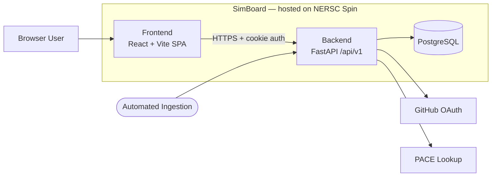
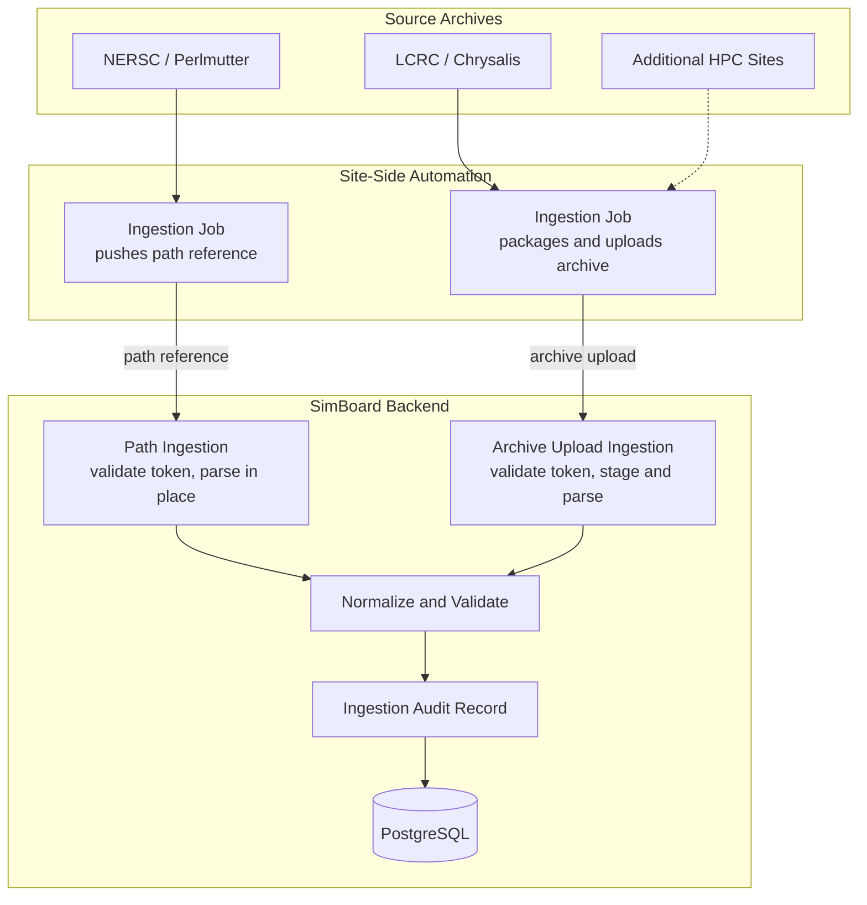

# Developer Guide

Use this guide for local setup, repo-wide development workflow, and contributor-oriented architecture. For service-specific detail, see [backend/README.md](../../backend/README.md) and [frontend/README.md](../../frontend/README.md).

## Local Setup

Prerequisites:

- [Docker Desktop](https://www.docker.com/products/docker-desktop/) or compatible local Docker runtime
- [`uv`](https://docs.astral.sh/uv/getting-started/installation/) — fast Python package manager (replaces pip/venv)
- [Node.js](https://nodejs.org/) and [`pnpm`](https://pnpm.io/installation) — JavaScript runtime and package manager

Recommended first-run flow from the repository root:

```bash
make setup-local
make backend-run
make frontend-run
```

Open:

- API docs: `https://127.0.0.1:8000/docs`
- UI: `https://127.0.0.1:5173`

What `make setup-local` does:

- copies `.envs/example/*` into `.envs/local/` if missing
- generates local TLS certs in `certs/`
- starts PostgreSQL from `docker-compose.local.yml`
- installs backend and frontend dependencies
- runs Alembic migrations
- seeds development data

Useful commands:

```bash
make backend-test          # run backend pytest suite
make frontend-lint         # lint frontend with ESLint
make pre-commit-run        # run all pre-commit hooks (formatting, linting, etc.)
pnpm --dir frontend run type-check  # TypeScript type checking (no Makefile wrapper yet)
make help                  # list all available Makefile targets
```

## GitHub Auth Setup

If you need authenticated browser flows such as upload:

1. [Create a GitHub OAuth app](https://github.com/settings/developers) with homepage `https://127.0.0.1:5173`.
2. Set the callback URL to `https://127.0.0.1:8000/api/v1/auth/github/callback`.
3. Put the GitHub credentials in `.envs/local/backend.env`.
4. Restart `make backend-run`.

If you need admin-only local flows such as service-account or token provisioning:

```bash
make backend-create-admin
```

For token-based ingestion and service-account details, see [docs/hpc_api_token_authentication.md](../hpc_api_token_authentication.md).

## Assistant LLM Env Setup

If you want the simulation details page to use LLM-backed summaries instead of deterministic fallback, configure the assistant env values in `.envs/local/backend.env`.

Canonical assistant env names:

- `ASSISTANT_LLM_ENABLED`
- `ASSISTANT_LLM_PROVIDER` with `openai`, `anthropic`, or `livai`
- `ASSISTANT_OPENAI_API_KEY` / `ASSISTANT_OPENAI_MODEL`
- `ASSISTANT_ANTHROPIC_API_KEY` / `ASSISTANT_ANTHROPIC_MODEL`
- `ASSISTANT_LIVAI_API_KEY` / `ASSISTANT_LIVAI_MODEL` / `ASSISTANT_LIVAI_BASE_URL`
- `ASSISTANT_LLM_TEMPERATURE` default `0.2`
- `ASSISTANT_LLM_MAX_TOKENS` default `2048`

Recommended setup flow:

1. Open `.envs/local/backend.env`.
2. Set `ASSISTANT_LLM_ENABLED=true`.
3. Choose exactly one provider in `ASSISTANT_LLM_PROVIDER`.
4. Fill only that provider's required env vars.
5. Restart the backend with `make backend-run`.
6. Generate an AI Summary from the simulation details page and confirm it does not fall back to deterministic mode.

Recommended local default for this repo:

```env
ASSISTANT_LLM_ENABLED=true
ASSISTANT_LLM_PROVIDER=livai
ASSISTANT_LIVAI_API_KEY=
ASSISTANT_LIVAI_MODEL=
ASSISTANT_LIVAI_BASE_URL=https://livai-api.llnl.gov/
ASSISTANT_LLM_TEMPERATURE=0.2
ASSISTANT_LLM_MAX_TOKENS=2048
```

Direct OpenAI setup:

```env
ASSISTANT_LLM_ENABLED=true
ASSISTANT_LLM_PROVIDER=openai
ASSISTANT_OPENAI_API_KEY=
ASSISTANT_OPENAI_MODEL=
ASSISTANT_LLM_TEMPERATURE=0.2
ASSISTANT_LLM_MAX_TOKENS=2048
```

If `ASSISTANT_LLM_ENABLED=false`, or the selected provider is misconfigured, the backend automatically returns the deterministic metadata summary instead of an LLM-generated one.

For LivAI, `ASSISTANT_LIVAI_API_KEY` and `ASSISTANT_LIVAI_BASE_URL` are the canonical names.
For the current LivAI OpenAI-compatible chat endpoint, SimBoard omits `ASSISTANT_LLM_TEMPERATURE` for `gpt-5*` models because the endpoint rejects that parameter; `ASSISTANT_LLM_MAX_TOKENS` still applies.

If summary generation still falls back:

- `fallback_reason=openai_misconfigured` means the backend is still configured for `openai`, but `ASSISTANT_OPENAI_API_KEY` or `ASSISTANT_OPENAI_MODEL` is missing.
- `fallback_reason=anthropic_misconfigured` means `ASSISTANT_ANTHROPIC_API_KEY` or `ASSISTANT_ANTHROPIC_MODEL` is missing.
- `fallback_reason=livai_misconfigured` means `ASSISTANT_LIVAI_API_KEY`, `ASSISTANT_LIVAI_MODEL`, or `ASSISTANT_LIVAI_BASE_URL` is missing.
- If you edit `.envs/local/backend.env`, restart `make backend-run` before testing again.

## Architecture

SimBoard is a web application for cataloging and comparing E3SM simulation metadata. The full application (frontend, backend, and database) is hosted on NERSC Spin. Automated ingestion jobs running on HPC sites collect metadata from an E3SM performance archive and push it to SimBoard, where the backend normalizes it and the frontend lets researchers browse, compare, and analyze results.



- **Frontend** — browse, detail, compare, auth, and upload views. Calls the backend over HTTPS via `frontend/src/api/api.ts` with credentials enabled for cookie auth.
- **Backend** — parses ingested archives, applies validation and reference-simulation rules, persists normalized records, and exposes `/api/v1` endpoints.
- **PostgreSQL** — stores cases, simulations, machines, users, tokens, artifacts, links, and ingestion records.
- **External services** — GitHub OAuth (user login) and PACE (performance lookup).

## Automated HPC Metadata Ingestion

HPC sites automatically produce `performance_archive` metadata. Automated ingestion jobs running on those sites collect the metadata and push it to SimBoard through one of two ingestion modes:

- **Path ingestion** — an ingestion job sends a path reference to SimBoard, and the backend reads the archive directly from a mounted filesystem (used when the site's storage is accessible to NERSC Spin, e.g., NERSC / Perlmutter).
- **Archive upload** — an ingestion job packages the archive and uploads it to SimBoard over HTTPS (used when the filesystem is not accessible from NERSC Spin, e.g., LCRC / Chrysalis).



All ingestion requests require a bearer API token. Site-side ingestion jobs are configured with machine name, source path, API URL, state path, dry-run flag, and the token.

After ingestion completes, the backend stores normalized cases, simulations, machines, artifacts, links, and audit records in PostgreSQL. The frontend reads the resulting catalog data through `/api/v1` endpoints.

> **Note**
>
> SimBoard records artifact references, including output directories, source archive locations, run scripts, and batch logs, to support reproducibility.
>
> Referenced case directories under source archive locations are periodically cleaned up by scheduled site-side jobs outside of SimBoard to limit storage growth.

| Site                 | Ingestion mode            | Source archive location                                                |
| -------------------- | ------------------------- | ---------------------------------------------------------------------- |
| NERSC / Perlmutter   | Path reference            | `/global/cfs/projectdirs/e3sm/performance_archive`                     |
| LCRC / Chrysalis     | Archive upload            | `/lcrc/group/e3sm/PERF_Chrysalis/performance_archive`                  |
| Additional HPC sites | Archive upload by default | Site-specific `performance_archive` path, packaged by the ingestion job |

## Daily Workflow

Common tasks beyond the initial setup:

```bash
make backend-run                   # start backend with hot reload
make frontend-run                  # start frontend with hot reload
make backend-test                  # run full backend test suite
make backend-seed                  # seed the database with sample data
make backend-rollback-seed         # remove seeded data
make backend-upgrade               # apply pending Alembic migrations
make backend-downgrade rev=<rev>   # roll back to a specific Alembic revision
make backend-reset                 # recreate the backend venv and reinstall deps
make frontend-lint                 # lint frontend
make frontend-fix                  # lint frontend with auto-fix
make pre-commit-run                # run all pre-commit hooks
```

To reset the database completely, stop the backend, bring down the Docker container, remove the volume, then re-run setup:

```bash
docker compose -f docker-compose.local.yml down -v
make setup-local
```

To run a single backend test file or test function:

```bash
cd backend
uv run pytest tests/path/to/test_file.py
uv run pytest tests/path/to/test_file.py::test_function_name
```

## Making a Change — Walkthrough

### Backend example: add a new API field

1. **Read** the relevant feature code under `backend/app/features/` and the corresponding test file under `backend/tests/`.
2. **Edit** the schema, model, or endpoint as needed.
3. **Migrate** if the change touches the database schema:

   ```bash
   make backend-migrate m='add field_name to table_name'
   make backend-upgrade
   ```

4. **Test**:

   ```bash
   make backend-test
   ```

5. **Validate** with pre-commit before committing:

   ```bash
   make pre-commit-run
   ```

6. **Commit and push**, then open a PR per [CONTRIBUTING.md](../../CONTRIBUTING.md).

### Frontend example: update a feature component

1. **Read** the feature module under `frontend/src/features/` and its API/hooks directories.
2. **Edit** the component, hook, or API call.
3. **Lint and type-check**:

   ```bash
   make frontend-lint
   pnpm --dir frontend run type-check
   ```

4. **Validate** with pre-commit:

   ```bash
   make pre-commit-run
   ```

5. **Commit and push**, then open a PR.

Key rule: feature modules must not import from other feature modules. If you need to share code between features, move it to `frontend/src/components/shared/` or `frontend/src/lib/`.

## Troubleshooting

**Docker not running or port conflict**
`make setup-local` starts PostgreSQL via Docker Compose. If Docker Desktop is not running, or port 5432 is already in use, the setup will fail. Start Docker Desktop and stop any conflicting services first.

**Missing environment variables**
If the backend fails to start with config or env errors, regenerate the env files:

```bash
make setup-local-assets
```

This copies `.envs/example/*` into `.envs/local/` without overwriting existing files.

**SSL / certificate errors**
The backend and frontend use local TLS certs from `certs/`. If they are missing or expired, regenerate them:

```bash
make gen-certs
```

Your browser will show a self-signed certificate warning — this is expected for local development.

**`uv` or `pnpm` not found**
The backend uses `uv` (not pip) and the frontend uses `pnpm` (not npm/yarn). Both must be on your `PATH`. See the [Prerequisites](#local-setup) section for install links.

**Pre-commit fails or gives inconsistent results**
Always run pre-commit from the repository root, not from `backend/` or `frontend/`. Some hooks (e.g., `mypy`) depend on root-relative config paths.

```bash
# correct
make pre-commit-run

# incorrect — may produce wrong results
cd backend && uv run pre-commit run --all-files
```

**Frontend ESLint error about cross-feature imports**
Feature modules under `frontend/src/features/*/` must not import from other features. This is enforced by `eslint-plugin-boundaries`. Move shared code to `frontend/src/components/shared/` or `frontend/src/lib/`.

**Database out of sync after pulling new changes**
If a teammate added a migration, apply it:

```bash
make backend-upgrade
```

If the schema diverged significantly, reset the database entirely:

```bash
docker compose -f docker-compose.local.yml down -v
make setup-local
```

## Contributing

See [CONTRIBUTING.md](../../CONTRIBUTING.md) for issue, branch, commit, and PR expectations.

Key habits for safe changes:

- read the touched feature before editing it
- keep frontend feature boundaries intact (`eslint-plugin-boundaries` enforces this)
- update backend tests when behavior changes
- add Alembic migrations when schema changes
- run `make pre-commit-run` from the repository root, not from subdirectories

## Where Important Details Live

- backend service detail: [backend/README.md](../../backend/README.md)
- frontend service detail: [frontend/README.md](../../frontend/README.md)
- docs index: [docs/README.md](../README.md)
- CI/CD and deployment docs: [docs/cicd/README.md](../cicd/README.md)
